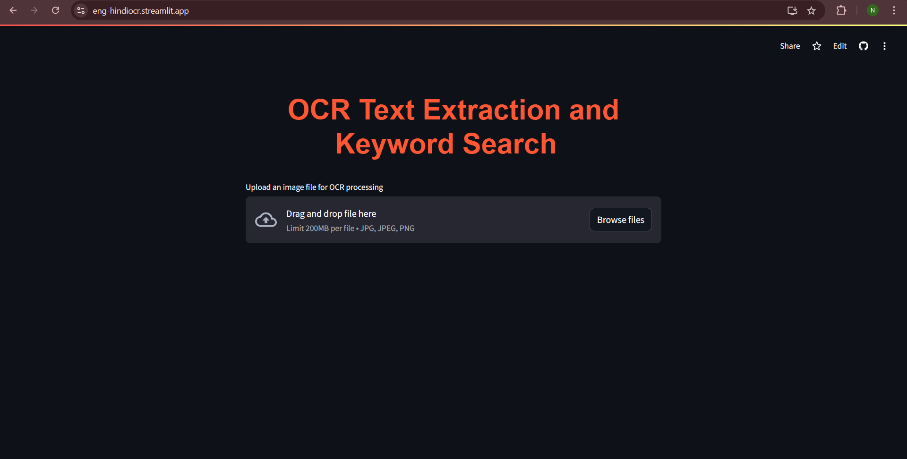
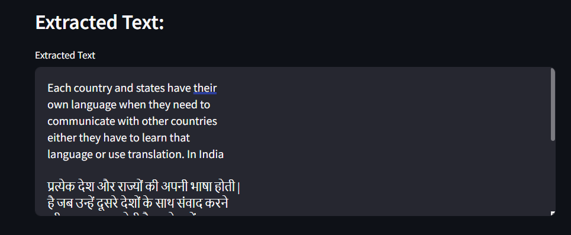
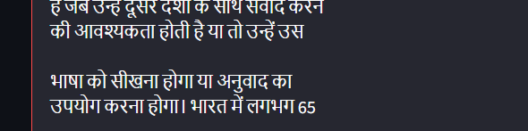
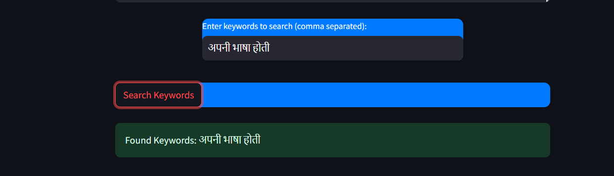
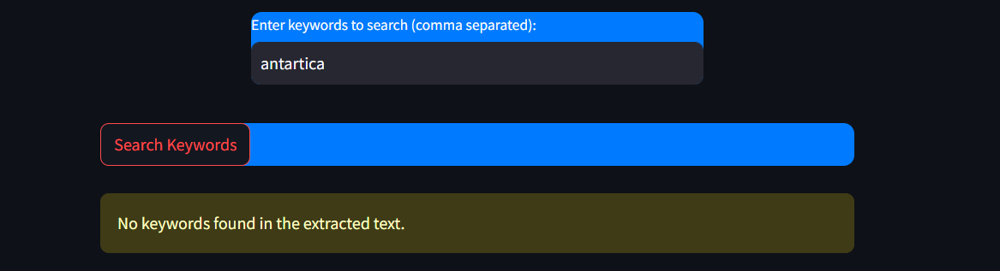

# OCR Project  and Keyword Search

## Overview
This project implements an Optical Character Recognition (OCR) system specifically designed for recognizing English and Hindi Devanagari characters. By utilizing the pre-trained **GOT-OCR2.0** model from Hugging Face's Transformers library, we can effectively recognize and classify images of Devanagari text. The project also features a keyword search functionality that allows users to search for specific terms in the OCR outputs.

## Introduction
Optical Character Recognition (OCR) is a technology used to convert different types of documents, such as scanned paper documents, PDFs, or images taken by a digital camera, into editable and searchable data. This project aims to focus on the recognition of Devanagari characters, which are used in several Indian languages, including Hindi, Marathi, and Sanskrit.

The motivation behind this project is to create a robust OCR system that can recognize and process Devanagari text with high accuracy, which is particularly valuable in applications such as document digitization, language translation, and assistive technologies.

## Installation
To set up the project, ensure you have Python 3.6 or higher installed along with the necessary packages.
## Dataset
For fine-tuning the model https://archive.ics.uci.edu/ml/datasets/Devanagari+Handwritten+Character+Dataset was used.
The dataset consists of images of Devanagari characters organized in a directory structure where each character has its folder. The images should be in a format suitable for training (e.g., .jpg, .png). Each folder should be named with the character label, following the convention character_label.

## Model Overview
The GOT-OCR2.0 model is a state-of-the-art deep learning model tailored for OCR tasks. It is built upon the transformer architecture, which has proven to be highly effective for various natural language processing (NLP) and computer vision tasks. The model takes advantage of self-attention mechanisms to capture complex relationships between different parts of the input image, allowing for improved character recognition.

Key Features:
Pre-trained: The model comes pre-trained on large datasets, which helps in faster convergence during fine-tuning.
Flexible: It can be adapted to various OCR tasks, including multi-language support, by fine-tuning on domain-specific datasets.
Efficient: Utilizes transformer architecture for improved processing speed and accuracy.
Fine-Tuning the OCR Model
Fine-tuning refers to the process of taking a pre-trained model and training it further on a smaller, task-specific dataset. This approach is beneficial for several reasons:

Domain Adaptation: The GOT-OCR2.0 model is pre-trained on a diverse dataset. However, fine-tuning it on a Devanagari character dataset enables the model to learn specific features and nuances associated with the script, leading to improved accuracy.

Reduced Training Time: Fine-tuning a pre-trained model typically requires less training time and data compared to training a model from scratch. This is especially useful when working with limited data.

Improved Performance: By fine-tuning, the model can leverage the knowledge gained during pre-training while also adapting to the specific characteristics of the Devanagari characters, resulting in better overall performance.

Generalization: Fine-tuning helps the model generalize better to unseen data, enhancing its ability to recognize characters in different contexts.

## Model Training
The model is trained using the GOT-OCR2.0 architecture from Hugging Face's Transformers library. The following code snippet initializes the model, defines the loss function, and sets up the optimizer:

## Fine-Tuning OCR Model for Image Segmentation

In this project, we fine-tune a pre-trained Optical Character Recognition (OCR) model specifically designed for recognizing Devanagari characters. The process of fine-tuning allows us to adapt the model to our specific dataset, improving its performance on the tasks of character recognition and image segmentation.

### Why Fine-Tune an OCR Model?

1. **Domain-Specific Adaptation**: Pre-trained models are trained on large datasets, but they may not perform optimally on our specific data (Devanagari characters). Fine-tuning allows the model to learn the unique characteristics of our dataset, such as variations in font styles, sizes, and noise levels.

2. **Improved Accuracy**: Fine-tuning a model on a specific dataset typically leads to better accuracy. By training the model on images and labels from our Devanagari character dataset, we enable it to learn more relevant features, thereby increasing its recognition capabilities.

3. **Reduced Training Time**: Starting with a pre-trained model means we leverage the already learned features, requiring fewer epochs and less computational power to achieve satisfactory performance compared to training a model from scratch.

4. **Flexibility**: Fine-tuning allows us to modify the model architecture (e.g., changing the classifier head) to suit our specific number of classes and output requirements.

### Image Segmentation Process

Image segmentation is a crucial part of the OCR process, as it involves dividing an image into multiple segments to simplify its analysis. In the context of OCR, segmentation can help isolate characters or words in an image, making it easier for the model to recognize them.

1. **Data Preparation**: The dataset is structured to include various images of Devanagari characters, which are pre-processed to ensure uniformity in size and format. The dataset can be modified to limit the number of images per character, facilitating faster training.

2. **Model Architecture**: The model architecture is based on a pre-trained OCR model. The classification layer is modified to output predictions for the specific number of classes corresponding to our dataset.

#Keyword Search Functionality
The keyword search feature allows users to input keywords and find matches within the model's output. The following function checks for the presence of keywords:

## Usage
Prepare the Dataset: Organize your dataset in the specified directory structure.
Run the Training Script: Execute your training script to train the model.
Keyword Search: Use the provided function to search for keywords in the model's predictions.

## Result

